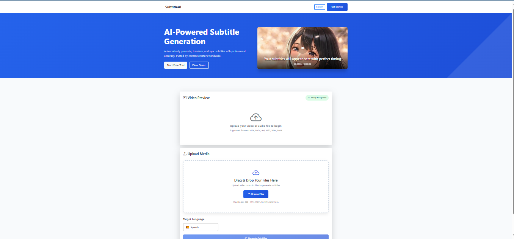
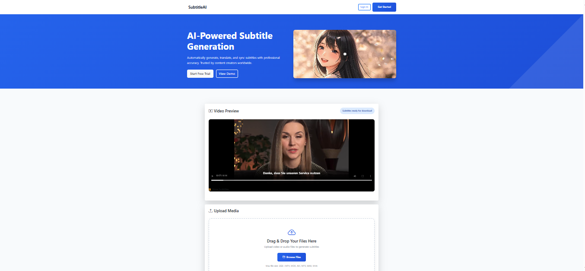
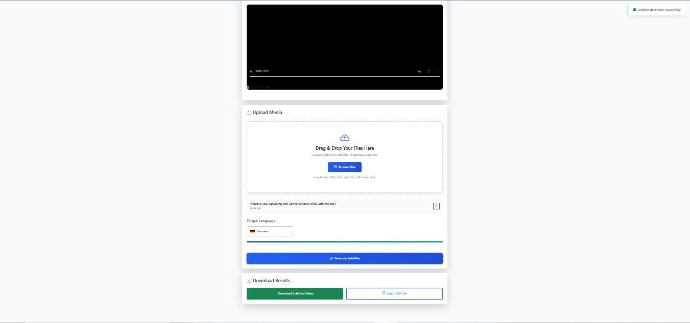

# Auto Subtitle Generator

A professional web application that automatically generates subtitles for video and audio files using Whisper for transcription, Hugging Face models for translation, and FFmpeg for subtitle embedding.

---

## 🚀 Features

- **Automatic Transcription**: Convert spoken words from video/audio into text using Whisper.  
- **Multilingual Subtitles**: Generate subtitles in multiple languages using Hugging Face Transformers.  
- **Subtitle Embedding**: Merge subtitles into videos with FFmpeg.  
- **Downloadable SRT Files**: Users can download `.srt` subtitle files.  
- **User-Friendly Web Interface**: Simple and clean interface for uploading and processing files.

---

## 💻 Tech Stack

- **Backend**: Python, Flask  
- **Speech-to-Text**: Whisper  
- **Translation**: Hugging Face Transformers  
- **Media Processing**: FFmpeg  
- **Frontend**: HTML, CSS, JavaScript

---

## 📦 Installation

1. Clone the repository:  
   ```bash
   git clone https://github.com/Alishba-Haroon/Auto-Subtitle-Generator.git
   cd Auto-Subtitle-Generator
   
2. Create and activate a virtual environment (recommended):
   ```bash
   python3 -m venv venv
   source venv/bin/activate     # Linux / macOS
   venv\Scripts\activate        # Windows

3. Install dependencies:
     ```bash
   pip install -r requirements.txt

4. Install FFmpeg on your system if not already installed.

5. Run the Flask app:
   ```bash
   flask run

6. Open your browser and navigate to http://localhost:5000.

## ⚙️ Usage

1. Upload a video or audio file via the web interface.

2. Select the desired subtitle language(s).

3. Click Generate to start transcription and translation.

4. Download the resulting .srt subtitle files or the video with embedded subtitles.

## 📸 Screenshots

# Auto Subtitle Generator

# Auto Subtitle Generator

## Main Interface
This is the main interface of the Auto Subtitle Generator where you can upload your video/audio files and generate subtitles in multiple languages.



### Input Example
You can upload your video or audio file like this:


### Output Example
After processing, the tool generates subtitles as shown below:



### Download Feature
Once the subtitles are generated, you can download the video with embedded subtitles or the separate subtitle files:




## 🛠️ Architecture Overview

1. File Upload: Users upload media files through Flask frontend.

2. Transcription: Whisper generates a text transcript from audio.

3. Translation: Optional translation via Hugging Face models.

4. Subtitle Generation: Create .srt files with timestamps.

5. Video Embedding: Subtitles embedded into videos using FFmpeg.

6. Output: Users can download subtitle files or subtitled video.

## 🙌 Contributing

Contributions are welcome! Steps to contribute:

1. Fork the repository.

2. Create a new branch: git checkout -b feature/my-feature

3. Commit changes: git commit -m "Add feature"

4. Push the branch: git push origin feature/my-feature

5. Open a Pull Request.

## 📄 License

This project is licensed under the MIT License — free to use, modify, and distribute.

## 💡 Future Improvements

Support more languages and translation models.

Batch processing for multiple videos.

Add alternative subtitle formats (e.g., VTT).

Improve UI/UX (progress bars, responsive design).

Add advanced error handling (large files, unsupported formats).

## 📧 Contact

GitHub: Alishba‑Haroon


